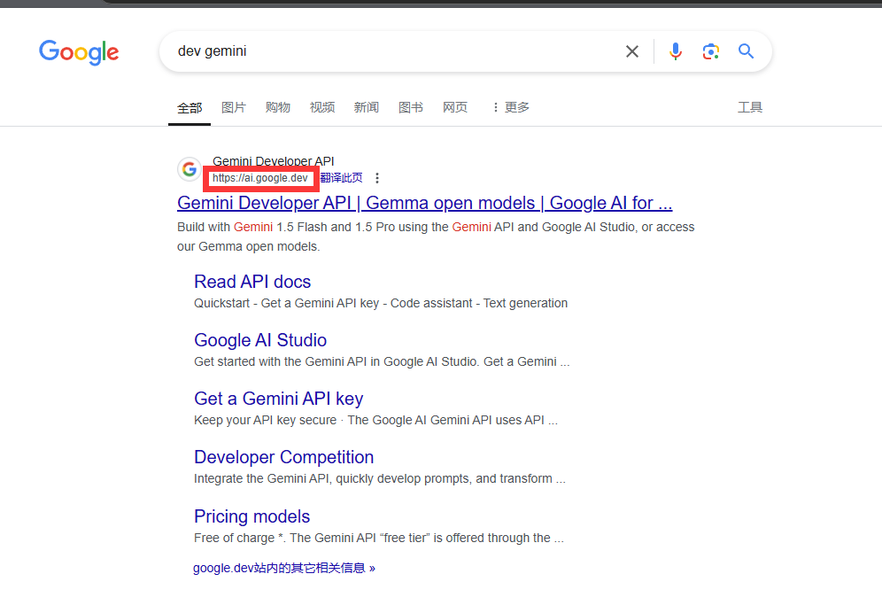
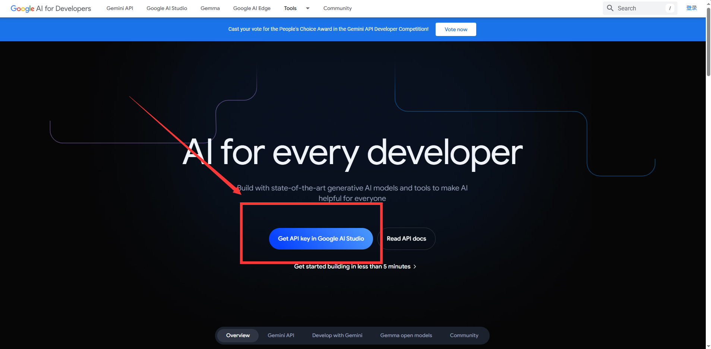
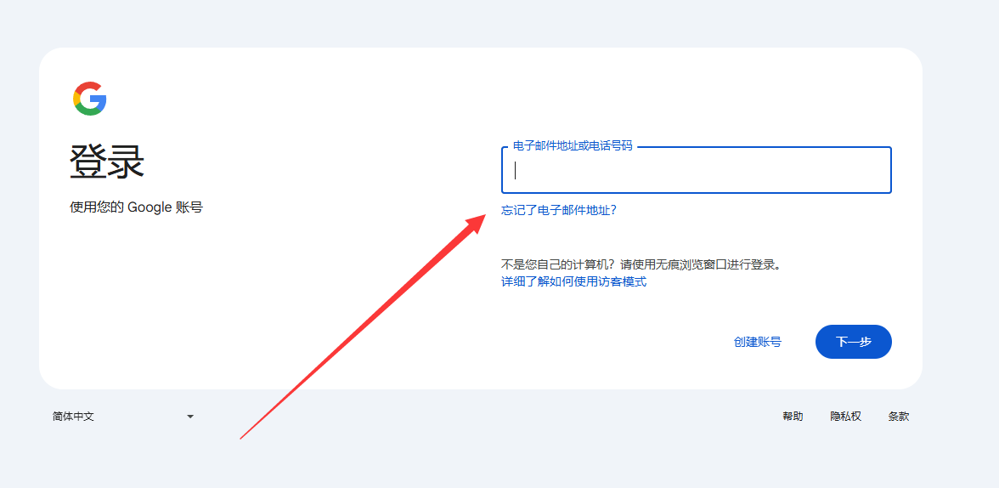
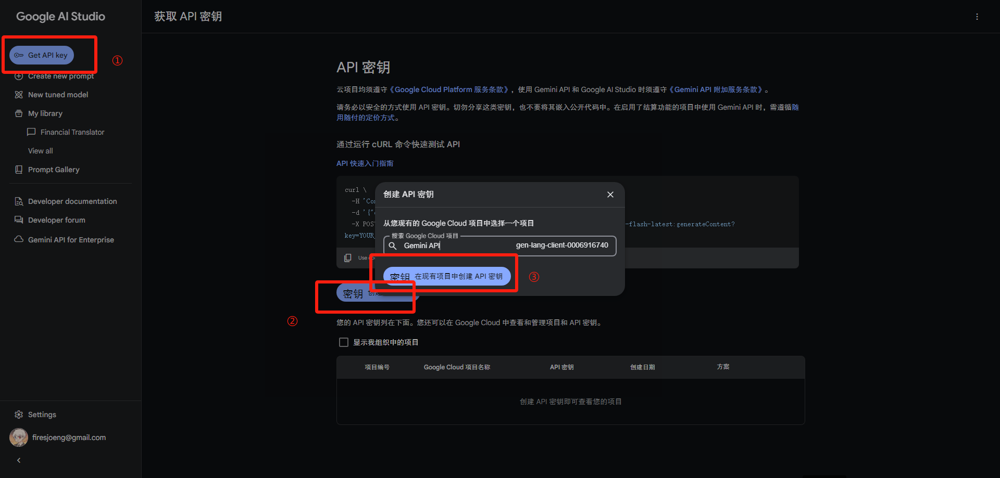
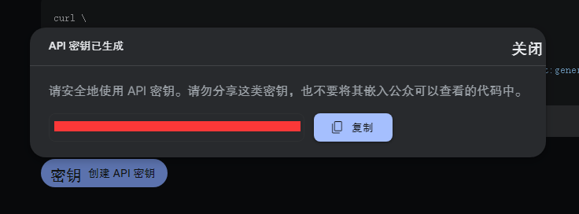
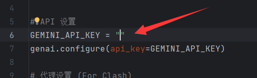

# py_genai_tutorial
一个在中国大陆境内配置Gemini API的Python实例教程

## 第一步
####  访问 "https://ai.google.dev", 或者谷歌搜索 "dev gemini", 进入Google AI Studio

## 第二步
#### 点击 "Get API key in Google AI Studio" 按钮

## 第三步
#### 如果未登录Google账户，那么按引导登录先

## 第四步
#### 依次点击以下几个按钮：
#### ① 页面左上角的 "Get API key" 按钮
#### ② 跳转页面中的 "密钥 创建API密钥" 按钮
#### ③ 弹出对话框中的 "密钥 在现有项目中创建API密钥" 按钮

## 第五步
#### 点击 "复制" 按钮, 拷贝你的API

## 第六步
#### 打开项目文件(main.py), 在GEMINI_API_KEY后的引号内，按 "Ctrl + V" 粘贴你的API

